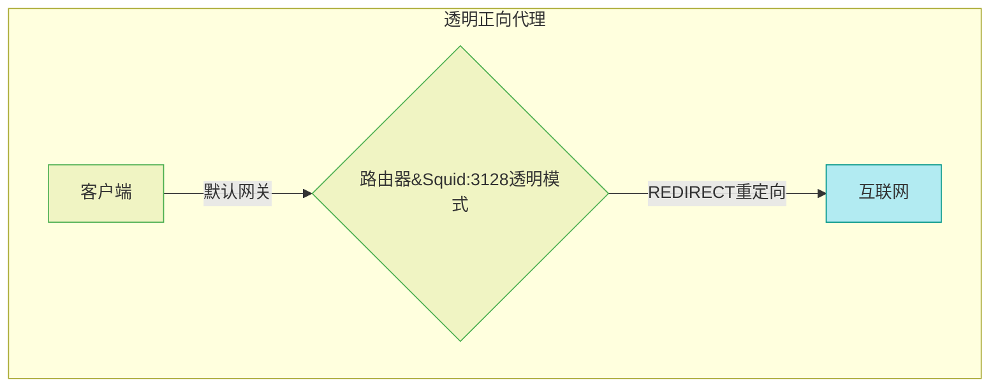
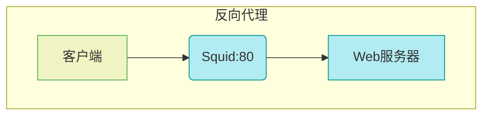

## Squid代理服务器部署

---

#### 一、Squid简介
##### 1. 软件发展介绍 

Squid由澳大利亚国立大学于1996年开发，现已成为开源代理服务领域的标准，支持HTTP、HTTPS、FTP等协议，与Rocky Linux等Red Hat系发行版深度兼容。最新版本优化了TLS 1.3支持和内存管理算法，显著提升高并发场景性能。

##### 2. 工作原理 

- 缓存机制：通过LRU（最近最少使用）算法管理磁盘和内存缓存，存储高频访问资源（如图片、CSS文件），降低源服务器负载。 
- 请求处理：客户端请求首先匹配缓存，未命中时通过ICP协议查询邻居代理，最终回源获取数据并缓存

```bash
LRU（Least Recently Used） 是一种基于时间局部性原理的缓存淘汰策略，核心目标是在有限空间内优先保留最近使用过的数据，提升缓存命中率。

# 淘汰逻辑：
当缓存空间不足时，LRU会优先淘汰最久未被访问的数据，而非最早存入的数据。
时间局部性假设：最近被访问的数据，短期内再次访问的概率更高。

# 操作特征：
访问即更新：每次命中缓存（如代理进程从缓存读取数据），该数据的“活跃度”会被刷新。
淘汰冷数据：新数据加入时，若缓存已满，则替换活跃度最低的旧数据。

`-------------------------------`

ICP（Internet Cache Protocol）是一种用于互联网缓存服务器之间进行通信的协议。它主要用于在多个缓存服务器之间共享缓存内容，从而提高网络效率，减少带宽消耗，提高网页加载速度。ICP 协议的设计初衷是使得缓存代理（proxy cache）能够有效地协作，以便更好地服务于客户端请求。

# 缓存请求：
当用户请求某个网页时，最初的请求会发送到本地的缓存服务器（如代理服务器）。

# 查找缓存：
如果本地缓存服务器没有缓存该内容，它会使用 ICP 向其他缓存服务器查询是否有该内容。

# ICP 查询：
本地缓存服务器会向其他缓存服务器发送 ICP 请求，询问它们是否已经缓存了所请求的对象。
ICP 请求包含对象的 URL 和一些元数据。

# 响应处理：
其他缓存服务器会根据是否缓存了请求的对象，回应 ICP 请求。响应可能包含内容的存在与否、对象的大小、最后修改时间等信息。
本地缓存服务器会根据其他缓存服务器的响应决定是否从其中一个缓存服务器获取内容，或者从源服务器（origin server）请求内容。

# 内容获取和存储：
如果其他缓存服务器有该内容，缓存服务器会从它们那里获取，并将内容缓存；如果没有，缓存服务器则会向原始服务器请求该内容。
```

##### 3. 适用场景

- 正向标准代理：企业内网用户安全访问互联网，实现访问审计与带宽控制。 
- 正向透明代理：ISP级流量管控，无需客户端配置，常用于学校、酒店网络。 
- 反向代理：为Web集群提供负载均衡和静态资源加速，降低后端服务器压力。

```bash
ISP（Internet Service Provider，互联网服务提供商）级流量管控是指互联网服务提供商在其网络基础设施中实施的一系列策略和技术，以管理、监控和优化用户的网络流量。这种管控旨在提升网络性能、保障服务质量、实现公平使用资源，以及遵循相关的法律法规。

ISP级流量管控的主要目的
# 优化网络性能：
通过流量管理，ISP 可以确保网络资源的有效利用，避免网络拥堵，提升整体用户体验。

# 保障QoS（服务质量）：
不同类型的流量（如视频流、语音通话、网页浏览等）对带宽的需求和延迟的敏感性不同。流量管控可以确保关键应用（如视频会议或在线游戏）获得必要的带宽和优先级。

# 带宽管理：
ISP可以根据用户的需求和服务套餐限制带宽使用，避免某些用户占用过多资源，影响其他用户的使用体验。

# 流量监控：
通过监控网络流量，ISP 可以识别异常流量、潜在的安全威胁（如DDoS攻击）和网络故障，及时采取措施。

# 遵循法规：
在某些国家或地区，ISP需要遵循法律法规，控制某些类型的流量（如盗版内容、非法活动等）。

ISP级流量管控是确保网络资源有效利用和用户体验的重要手段。通过合理的流量管理策略和技术，ISP能够在提升网络性能的同时，满足不同用户的需求。然而，ISP 也需要在流量管控与用户隐私、法规遵循之间进行权衡。
```


---

#### 二、环境准备
##### 1. 系统要求 

- 网络：双网卡配置（示例IP：外网 `ens160:192.168.3.120/24`，内网 `ens224:192.168.4.120/24`）。

##### 2. 软件安装 

```bash
# 安装Squid及依赖
$ dnf -y install squid firewalld iptables-nft-services
# 实验过程需要有防火墙完成一些列数据包处理，必须安装并开启防火墙服务

# 启动服务并设置开机自启
$ systemctl enable --now squid
```

##### 3. 网络配置验证 

```bash
# 检查双网卡IP
$ ip addr show ens160
$ ip addr show ens224

# 测试外网连通性
$ curl -I https://example.com
```

---

#### 三、实验步骤

##### 1. 标准正向代理

```mermaid

```

```apache
# 修改配置文件
$ vim /etc/squid/squid.conf

# 允许内网访问（添加在http_access deny all之前）
acl localnet src 192.168.3.0/24
http_access allow localnet

# 监听端口
http_port 3128

# 缓存目录设置（需提前创建）
cache_dir ufs /var/spool/squid 5000 16 256
```
```bash
# 创建缓存目录并授权
$ squid -z
$ chown -R squid:squid /var/spool/squid

# 重启服务
$ systemctl restart squid

# 客户端验证（Windows示例）
# Internet选项 → 连接 → 局域网设置 → 代理服务器地址:192.168.18.92:3128
$ curl -x http://192.168.3.120:3128 https://www.example.com

# Linux中测试
# 需要添加一个环境便利
export http_proxy="http://192.168.3.120:3128"
```

```bash
配置解释：
cache_dir ufs /var/spool/squid 5000 16 256

ufs
# 在 Squid 代理服务器中，UFS 是一种基于文件系统的缓存存储机制，用于管理代理数据的磁盘读写。

5000
# 这是缓存目录的总容量上限，单位为MB。此参数指定Squid在该目录下最多使用5000MB（即5GB）的磁盘空间。实际使用中需注意预留额外空间（约10%）用于存放临时文件和交换日志（如swap.state），避免因空间耗尽导致运行异常。

16
# 表示第一级子目录的数量（L1）。Squid会将缓存文件分散到多个子目录中以提升文件系统性能。例如，当L1为16时，会在缓存目录下创建名为00到0F（十六进制命名）的16个一级子目录。

256
# 表示每个一级子目录下的第二级子目录数量（L2）。例如，若L1为16且L2为256，则总共有16×256=4096个二级目录。每个二级目录下会进一步存储实际缓存文件，这种分层结构能有效避免单目录文件过多导致的性能问题。

# 注意：
1. 若缓存目录为/var/spool/squid，Squid会生成类似/var/spool/squid/00/00直至/var/spool/squid/0F/FF的路径，总计4096个二级目录。
2. L1和L2一旦设定后不可更改，否则会导致已有缓存文件无法访问。
3. 文件分布基于哈希算法，实际目录中的文件数量可能不均衡，但这是正常现象。
```

##### 2. 透明正向代理




```bash
# 启用IP转发
$ echo "net.ipv4.ip_forward=1" | tee /etc/sysctl.conf
$ sysctl -p

# 修改Squid为透明模式
$ vim /etc/squid/squid.conf
http_port 3128 intercept
# 在squid3.5版本后使用intercept替换了transparent,实现透明代理
visible_hostname localhost:3128
# 在使用了intercept后则必须声明squid的解析域名,并声明绑定端口,否则一些ico角标图片资源无法正常加载

# 配置防火墙实现REDIRECT重定向
$ iptables -t nat -A PREROUTING -i ens160 -s 192.168.3.0/24 -p tcp --dport 80 -j REDIRECT --to-ports 3128


#注意要使用squid代理上网，需要配置的防火墙规则为ens160为你的上网网卡
iptables -t nat -A POSTROUTING -s 192.168.1.0/24 -o ens160 -j MASQUERADE   （地址伪装）
# 客户端不再需要配置代理服务器的地址
# 记得清除掉浏览器或者操作系统全局的代理配置

使用 iptables 来设置网络流量的端口转发。

命令：
使用 ``iptables``

命令：
iptables -t nat -A PREROUTING -i ens160 -s 192.168.3.0/24 -p tcp --dport 80 -j REDIRECT --to-ports 3128

命令解释：
- `iptables`：这是 Linux 系统下的一个用户空间工具，用于设置、维护和检查 Linux 内核的 IP 数据包过滤规则。
- `-t nat`：指定操作的表为 NAT（网络地址转换）表。NAT 表用于处理网络地址转换方面的规则。
- `-A PREROUTING`：表示在数据包到达本地路由之前添加规则到 PREROUTING 链。PREROUTING 链用于处理进入网络接口的数据包。
- `-i ens160`：指定要处理的网络接口，这里为 `ens160`。只有在该接口接收到的数据包才会被该规则处理。
- `-s 192.168.3.0/24`：指定源IP地址范围为 192.168.3.0 到 192.168.3.255 的所有主机。
- `-p tcp`：指定协议为 TCP。
- `--dport 80`：表示要匹配的目标端口为 80。
- `-j REDIRECT`：表示对匹配的数据包进行重定向。
- `--to-ports 3128`：将匹配的流量重定向到本地的 3128 端口。

# 总结
- iptables 命令也实现了类似的功能，但它是在 NAT 表中执行相同的端口重定向，以处理来自特定子网的 TCP 流量。
这两种方式都可以有效地实现对网络流量的管理和控制，具体选择取决于系统配置和管理员的喜好。
```
##### 3. 反向代理




```bash
# 配置后端服务器组
$ vim /etc/squid/squid.conf
```
```apache
# 定义Web服务器集群
cache_peer 192.168.2.222 parent 80 0 no-query round-robin name=web
正常来说只需要上下两行就行了
注意需要清空防火墙规则
iptables -t nat -nL
iptables -t nat -F
# 加速模式配置
http_port 80 vhost

acl all src 0.0.0.0/0
http_access allow all

cache_peer_access web allow all
```
```bash
# 压力测试（需安装Apache Bench - httpd-tools）
$ ab -n 1000 -c 100 http://192.168.18.92/index.html
```

```bash
# 基本参数：
192.168.18.102
# 目标主机的 IP 地址，表示 Squid 将与此服务器建立连接。
parent
# 指定该服务器类型为 父代理（Parent），即本地 Squid 缓存未命中时，会将请求转发至此服务器获取数据。
80
# 目标服务器的 HTTP 服务端口，用于接收 Squid 的代理请求。
0
# ICP（Internet Cache Protocol）端口，设为 0 表示禁用 ICP 协议查询。

# 核心选项：
no-query
# 禁止 Squid 向此服务器发送 ICP 查询，直接通过 HTTP 协议获取数据。适用于目标服务器不支持 ICP 的场景，可减少网络延迟。
round-robin
# Squid 会以轮询方式分发请求到各服务器，实现负载均衡。若仅配置单台服务器，此选项为冗余设置，但为后续扩展预留了配置空间。
name=web
# 为此代理服务器分配别名 web，便于后续通过 cache_peer_domain 或 cache_peer_access 规则定向控制流量。
```

---

#### 四、高级配置(了解)
##### 1. 访问控制 

```bash
$ vim /etc/squid/squid.conf
```

```apache
acl badsite dstdomain .youtube.com
acl badsite dstdomain .douyin.com
acl chaoge url_regex sc
http_access deny
http_access deny badsite
acl workhours time MTWHF 09:00-18:00
http_access deny !workhours
```

##### 2. 日志分析  

```bash
# 实时监控访问日志
$ tail -f /var/log/squid/access.log | awk '{print $3,$7,$8}'
```

---

#### 五、故障排查
##### 1. 常见错误  

- 403 Forbidden：检查 `http_access` 顺序，确保allow规则在deny之前。  
- 地址绑定失败：确认SELinux状态 `getenforce`，临时禁用 `setenforce 0` 或永久禁用。

##### 2. 性能调优  

```apache
# 调整内存缓存大小（单位MB）
cache_mem 512			
# 缓存占内存大小

maximum_object_size_in_memory 256 KB
# 最大缓存块

# 限制请求内容大小
reply_body_max_size 10 MB
```

---