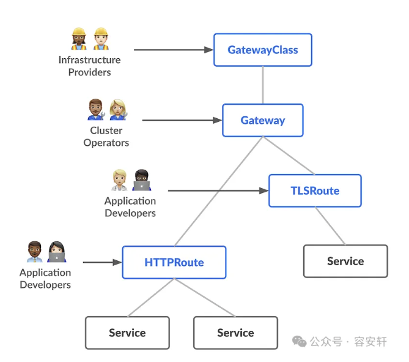
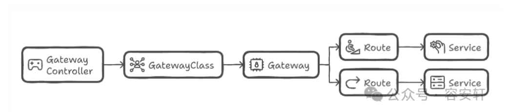
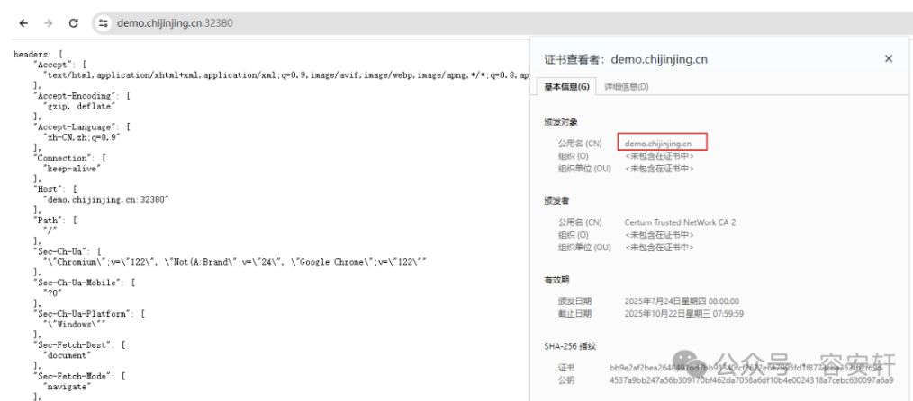
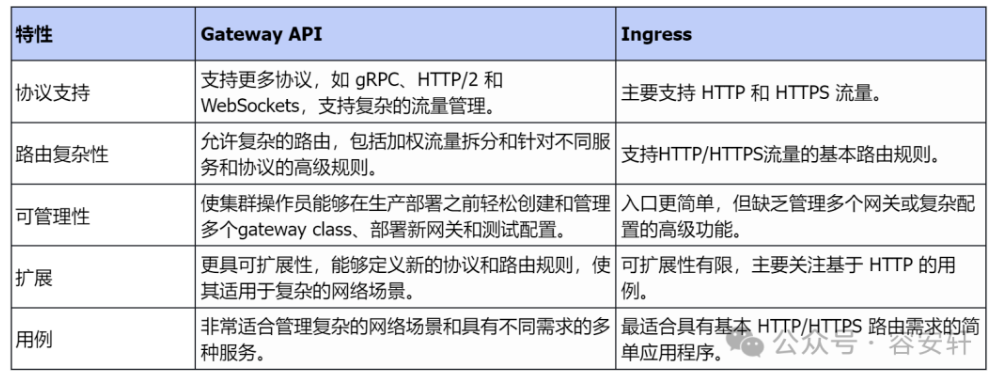

## Gateway API 介绍

Kubernetes Gateway API 是一种规范，用于在 Kubernetes 集群中管理流量路由。它是由 Kubernetes SIG-NETWORK 小组创建的，作为 Ingress 的替代方案。Gateway API 可以更轻松地处理入口流量、负载均衡、服务发现和流量路由等内容。

Gateway API 引入了一种面向角色的模型，该模型在基础设施提供商、集群维护者和应用程序开发人员之间划分职责。它定义了网关资源，例如 GatewayClass、Gateway 和 Routes，从而实现对管理流量和服务网络的细粒度控制。Gateway API 支持多种协议、改进的路由配置以及与服务网格架构的集成功能，为传统入口网关 API 提供了现代、可扩展的替代方案。

*   **基础设施提供者** ：云服务提供商或基础设施厂商，负责提供 GatewayClass 实现

*   **集群运维人员** ：管理集群资源，创建和维护 Gateway 实例

*   **应用程序开发者** ：开发和部署应用程序，定义应用的路由需求

*   **应用管理员** ：管理复杂应用系统，负责应用级别的策略配置

Gateway API 主要由三个组件组成：

1.  GatewayClass: 是集群级别的资源，定义一组具有共同配置和行为的网关。它类似于 `IngressClass` 或 `StorageClass`，由基础设施提供方创建。

2.  Gateway: 描述如何将外部流量路由到集群内的服务。

3.  HTTPRoute： 是最常用的路由类型，用于处理 HTTP 和 HTTPS 流量

  


Gateway API 是如何工作的
------------------

  



### Gateway Controller

与 Ingress Controller 类似， Gateway Controller 是管理所有网关资源的核心组件。它负责确保正确实现网关资源中定义的配置。 Gateway Controller 监听 Gateway、GatewayClass 和 Route 对象中的更改，然后相应地更新网络配置以处理定义的传入流量。这使 Kubernetes 集群能够对路由配置的变化做出反应并有效地管理流量。

Gateway Controller的实现方案：https://gateway-api.sigs.k8s.io/implementations/#gateway-controller-implementation-status

## GatewayClass

GatewayClass 定义集群中 Gateway 的行为和配置，可以将其视为 Gateway 资源的模板。它指定哪个控制器来管理 Gateway （可以是 Istio 、Traefik、Kong 等开源方案或自定义实现）。GatewayClass 还包含 IP 池和资源限制等配置，基础设施提供商负责定义和管理 GatewayClass。

```yaml
apiVersion: gateway.networking.k8s.io/v1
kind: GatewayClass
metadata:
  name: example-gatewayclass
spec:
  controller: example.com/gateway-controller
```

## Gateway

定义 GatewayClass 后，就可以基于它创建一个 Gateway 对象。Gateway 对象是根据特定的 GatewayClass 创建的。它定义了流量如何进入集群以及哪些侦听器将处理流量（例如 HTTP、HTTPS）。单个网关可以处理多个应用程序的流量，这些应用程序可以共享同一个网关。

```yaml
apiVersion: gateway.networking.k8s.io/v1
kind: Gateway
metadata:
  name: example-gateway
spec:
  gatewayClassName: example-gatewayclass
  listeners:
    - name: http
      port: 80
      protocol: HTTP
```

上面的声明定义了一个名为 example-gateway 的网关，它使用之前创建的 example-gatewayclass，使用 HTTP 协议监听 80 端口来处理传入流量。

## HTTPRoute

设置 Gateway 后，定义 HTTPRoutes（或其他路由类型，如 TCPRoute）以指定流量应如何转发到集群中不同的服务上。HTTPRoute 对象定义路由 HTTP 流量的规则，例如匹配路径、Header 或其他 HTTP 属性。HTTPRoute 对象负责把流量路由到 Kubernetes 中具体的 Service 对象上。

```yaml
apiVersion: gateway.networking.k8s.io/v1
kind: HTTPRoute
metadata:
  name: example-httproute
spec:
  hosts:
    - "example.com"
  rules:
    - matches:
        - path:
            type: Prefix
            value: /app
      forwardTo:
        - serviceName: app-service
          port: 80
```

这定义了一个名为 example-httproute 的 HTTPRoute，它监听对 example.com 的请求，将路径为 /app 的请求转发到 `app-service` 服务的 80 端口上。

上述组件协同工作，可以更轻松地管理 Kubernetes 中的流量路由。使团队能够更好地控制网络流量的传输方式以及如何处理安全性。这样设计的目的是使 基础设施提供商、集群维护者和应用程序开发人员等不同团队能够顺利协作，而不会干扰彼此的工作。

# 安装和使用 Gateway API

## 1 安装 Gateway API CRD

```bash
kubectl apply -f https://github.com/kubernetes-sigs/gateway-api/releases/download/v1.3.0/standard-install.yaml
```

## 2 安装 Kong Kubernetes Ingress Controller

Kong Ingress Controller 即可以做 Ingress 控制器，也可以做 Gateway 控制器，具体可以参照 Kong 官网文档：https://developer.konghq.com/kubernetes-ingress-controller。

```bash
helm repo add kong https://charts.konghq.com
helm repo update
helm install kong kong/ingress -n kong --create-namespace
```

## 3 创建 GatewayClass

kong-gatewayclass.yaml

```yaml
apiVersion: gateway.networking.k8s.io/v1
kind: GatewayClass
metadata:
  name: kong
  annotations:
    konghq.com/gatewayclass-unmanaged: 'true'
spec:
  controllerName: konghq.com/kic-gateway-controller
```

## 4 创建 Gateway

kong-gateway.yaml

```yaml
apiVersion: gateway.networking.k8s.io/v1
kind: Gateway
metadata:
  name: kong
spec:
  gatewayClassName: kong
  listeners:
  - name: proxy
    port: 80
    protocol: HTTP
    allowedRoutes:
      namespaces:
         from: All
```

## 5 验证 Gateway Controller 是否安装成功

```bash
# kubectl get gatewayclass
```

## 6 案例一 HTTPRoute 创建前缀匹配路由

创建测试应用： demo-app.yaml

```yaml
apiVersion: apps/v1
kind: Deployment
metadata:
  name: go-httpbin
  namespace: default
spec:
  replicas: 1
  selector:
    matchLabels:
      app: go-httpbin
  template:
    metadata:
      labels:
        app: go-httpbin
        version: v1
    spec:
      containers:
        - image: ccr.ccs.tencentyun.com/chijinjing/go-httpbin:v3
          args:
            - "--port=8090"
            - "--version=v1"
          imagePullPolicy: Always
          name: go-httpbin
          ports:
            - containerPort: 8090
---
apiVersion: v1
kind: Service
metadata:
  name: go-httpbin
  namespace: default
spec:
  ports:
    - port: 80
      targetPort: 8090
      protocol: TCP
  selector:
    app: go-httpbin
```

创建 HTTPRoute demo-route.yaml，匹配前缀正确的请求路由到后端应用。

```yaml
apiVersion: gateway.networking.k8s.io/v1beta1
kind: HTTPRoute
metadata:
  name: demo-route
spec:
  parentRefs: # 引用Gateway资源。
    - group: gateway.networking.k8s.io
      kind: Gateway
      name: kong
  hostnames:
    - demo.chijinjing.cn # host设置为 demo.chijinjing.cn
  rules:
    - matches: # 匹配规则为前缀匹配路径。
        - path:
            type: PathPrefix
            value: /
      backendRefs: # 后端为类型为Service，名称go-httpbin，端口80。
        - kind: Service
          name: go-httpbin
          port: 80
```

创建测试应用和 HTTPRoute 资源

```bash
kubectl apply -f demo-app.yaml -f demo-route.yaml
```

验证前先配置域名解析， 生产环境建议使用 LoadBalancer，测试环境我们就直接使用 NodePort 的方式访问。

```bash
kong-gateway-proxy    LoadBalancer   10.96.3.39    <pending>     80:31302/TCP,443:32380/TCP      75m
```

修改 `/etc/hosts` 文件，添加 `Node-ip demo.chijinjing.cn`

```bash
# curl http://demo.chijinjing.cn:31302/
headers: {
    "Accept": [
      "*/*"
    ],
    "Connection": [
      "keep-alive"
    ],
    "Host": [
      "demo.chijinjing.cn:31302"
    ],
```

## 7 案例二 HTTPRoute 创建权重路由

HTTPRoute 支持权重路由， 流量 按权重路由到不同的应用

创建测试应用 app-weight.yaml

```yaml
apiVersion: apps/v1
kind: Deployment
metadata:
  name: old-nginx
spec:
  replicas: 1
  selector:
    matchLabels:
      run: old-nginx
  template:
    metadata:
      labels:
        run: old-nginx
    spec:
      containers:
      - image: registry.cn-hangzhou.aliyuncs.com/acs-sample/old-nginx
        imagePullPolicy: Always
        name: old-nginx
        ports:
        - containerPort: 80
          protocol: TCP
      restartPolicy: Always
---
apiVersion: v1
kind: Service
metadata:
  name: old-nginx
spec:
  ports:
  - port: 80
    protocol: TCP
    targetPort: 80
  selector:
    run: old-nginx
  sessionAffinity: None
  type: NodePort
---
apiVersion: apps/v1
kind: Deployment
metadata:
  name: new-nginx
spec:
  replicas: 1
  selector:
    matchLabels:
      run: new-nginx
  template:
    metadata:
      labels:
        run: new-nginx
    spec:
      containers:
      - image: registry.cn-hangzhou.aliyuncs.com/acs-sample/new-nginx
        imagePullPolicy: Always
        name: new-nginx
        ports:
        - containerPort: 80
          protocol: TCP
      restartPolicy: Always
---
apiVersion: v1
kind: Service
metadata:
  name: new-nginx
spec:
  ports:
  - port: 80
    protocol: TCP
    targetPort: 80
  selector:
    run: new-nginx
  sessionAffinity: None
  type: NodePort
```

创建 HTTPRoute route-weight.yaml

```yaml
apiVersion: gateway.networking.k8s.io/v1beta1
kind: HTTPRoute
metadata:
  name: demo-weight
spec:
  parentRefs: # 引用 Gateway 资源。
    - group: gateway.networking.k8s.io
      kind: Gateway
      name: kong
  hostnames:
    - weight.chijinjing.cn # host设置为 weight.example.com
  rules:
    - matches: # 匹配规则为前缀匹配路径。
        - path:
            type: PathPrefix
            value: /
      backendRefs:
        # 设置后端以及对应权重，权重不为百分比形式，无需等于100。
        - kind: Service
          name: old-nginx
          port: 80
          weight: 1 # 设置old-nginx的权重为1。
        - kind: Service
          name: new-nginx
          port: 80
          weight: 1 # 设置new-nginx的权重为1。
```

部署

```bash
kubectl apply -f app-weight.yaml -f   route-weight.yaml
```

验证

```bash
# curl weight.chijinjing.cn:31302
old
# curl weight.chijinjing.cn:31302
new
# curl weight.chijinjing.cn:31302
old
# curl weight.chijinjing.cn:31302
new
```

## 8 案例三 HTTPRoute 修改请求头

使用 HTTPRoute 的 filter 能力，可以在请求或者回复阶段对请求头进行额外处理。本文以给发送到后端的请求添加请求头为例。

创建HTTPRoute资源，demo-filter.yaml

```yaml
apiVersion: gateway.networking.k8s.io/v1beta1
kind: HTTPRoute
metadata:
  name: demo-filter
spec:
  parentRefs: # 引用 Gateway 资源。
    - group: gateway.networking.k8s.io
      kind: Gateway
      name: kong
  hostnames:
    - filter.chijinjing.cn  # host设置为 filter.chijinjing.cn。
  rules:
    - matches: # 匹配规则为前缀匹配路径。
        - path:
            type: PathPrefix
            value: /
      filters:
        - type: RequestHeaderModifier # 添加请求头 my-header: foo。
          requestHeaderModifier:
            add:
              - name: my-header
                value: foo
      backendRefs: # 后端为类型为 Service，名称go-httpbin，端口80。
        - kind: Service
          name: go-httpbin
          port: 80
```

部署

```bash
kubectl apply -f demo-filter.yaml
```

验证，在返回响应中可以看到我们添加的头部信息 `My-Header`。

```bash
# curl filter.chijinjing.cn:31302
headers: {
    "Accept": [
      "*/*"
    ],
    "Connection": [
      "keep-alive"
    ],
    "Host": [
      "filter.chijinjing.cn:31302"
    ],
    "My-Header": [
      "foo"
    ],
```

## 9 案例四 配置 TLS 证书

修改 gateway 支持 HTTPS 协议

```yaml
apiVersion: gateway.networking.k8s.io/v1beta1
kind: Gateway
metadata:
  name: kong
spec:
  gatewayClassName: kong
  listeners:
  - name: proxy
    port: 80
    protocol: HTTP
  - name: proxy-ssl
    port: 443
    protocol: HTTPS
    hostname: demo.chijinjing.cn
    tls: # 配置TLS。
      mode: Terminate
      certificateRefs: # 引用所创建的secret。
        - kind: Secret
          name: demo-tls-secret
```

创建 Secret

```bash
kubectl create secret tls demo-tls-secret  \
  --key demo.chijinjing.cn.key \
  --cert demo.chijinjing.cn_bundle.crt
```

使用案例一的域名验证 `https://demo.chijinjing.cn:32380/` 可以看到如下返回信息，支持 HTTPS 协议了。



  

Gateway API 与 Ingress 对比
------------------------



总结
--

通过前面的几个案例我们可以感觉到 Gateway API 确实比 Ingress 具有更强的路由能力和更细粒度的路由控制，通过 GatewayClass、Gateway和 HTTPRoute 三个核心组件，实现灵活的路由控制。在架构上 Gateway API 采用角色划分设计，让云厂商、运维和开发者各司其职，支持多协议和服务网格集成，比传统 Ingress 更易扩展和协作。


